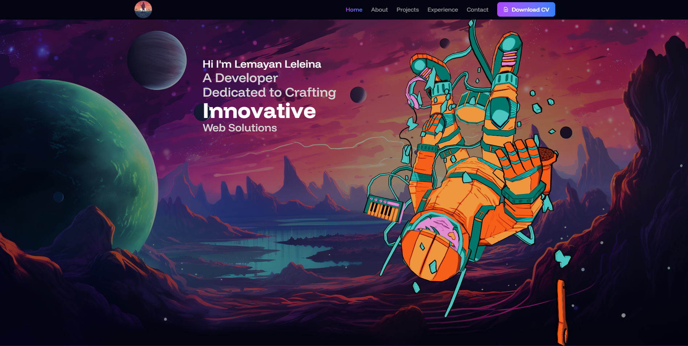

# Modern Portfolio Website

A stunning, fully responsive portfolio website built with React and cutting-edge web technologies. Features smooth animations, 3D graphics, and an elegant user interface.




## Features

- **Modern UI/UX** - Clean, professional design with smooth animations
- **Fully Responsive** - Optimized for all devices and screen sizes
- **Interactive 3D Elements** - Three.js powered spaceman model with orbit controls
- **Fast Performance** - Built with Vite for lightning-fast load times
- **Smooth Animations** - Framer Motion powered transitions and reveals
- **Contact Form** - Integrated EmailJS for seamless communication
- **Confetti Celebrations** - Fun animations on form submission
- **Loading Screen** - Custom animated loader with logo and sparkles
- **Scroll Animations** - Sections reveal as you scroll
- **Active Navigation** - Highlights current section in navbar
- **Legal Pages** - Terms & Conditions and Privacy Policy
- **Scroll to Top** - Quick navigation button
- **Page Transitions** - Smooth fade effects between routes

## Tech Stack

### Core
- **React 18** - UI library
- **Vite** - Build tool and dev server
- **JavaScript (ES6+)** - Programming language

### Styling
- **Tailwind CSS** - Utility-first CSS framework
- **PostCSS** - CSS processing
- **Autoprefixer** - CSS vendor prefixing

### Animations & Effects
- **Framer Motion** (motion/react) - Animation library
- **Magic UI Components** - Pre-built animated components
  - Particles effect
  - Marquee/carousel
  - Flip words animation
  - Orbiting circles

### 3D Graphics
- **Three.js** - 3D graphics library
- **React Three Fiber** (@react-three/fiber) - React renderer for Three.js
- **Drei** (@react-three/drei) - Useful helpers for R3F
  - OrbitControls
  - Float
  - useGLTF

### Routing & Forms
- **React Router DOM v6** - Client-side routing
- **EmailJS** (@emailjs/browser) - Email service integration

### Utilities
- **React Responsive** - Responsive design hooks
- **Maath** - Math utilities for animations
- **ESLint** - Code linting

## Prerequisites

Before you begin, ensure you have the following installed:
- **Node.js** (v16.0 or higher)
- **npm** or **yarn** package manager

## Getting Started

### 1. Clone the Repository

```bash
git clone https://github.com/lemayan/My_Portfolio.git
cd My_Portfolio
```

### 2. Install Dependencies

```bash
npm install
# or
yarn install
```

### 3. Environment Setup

Create a `.env` file in the root directory (optional, for EmailJS configuration):

```env
VITE_EMAILJS_SERVICE_ID=your_service_id
VITE_EMAILJS_TEMPLATE_ID=your_template_id
VITE_EMAILJS_PUBLIC_KEY=your_public_key
```

> **Note:** The current EmailJS configuration is hardcoded in `src/sections/Contact.jsx`. You can replace these values with your own EmailJS credentials.

### 4. Add Your Assets

Place your assets in the `public/assets/` directory:

```
public/
├── assets/
│   ├── logos/
│   │   └── morancoder.png (your logo)
│   ├── projects/ (project screenshots)
│   ├── socials/ (social media icons)
│   ├── programming languages/ (tech stack icons)
│   ├── frameworks/ (framework logos)
│   └── databases/ (database icons)
└── models/
    └── spaceman.glb (3D model)
```

### 5. Run Development Server

```bash
npm run dev
# or
yarn dev
```

The application will open at `http://localhost:5173`

### 6. Build for Production

```bash
npm run build
# or
yarn build
```

The optimized build will be in the `dist/` directory.

### 7. Preview Production Build

```bash
npm run preview
# or
yarn preview
```

## Project Structure

```
portfolio/
├── public/
│   ├── assets/          # Static assets (images, icons)
│   └── models/          # 3D models
├── src/
│   ├── components/      # Reusable components
│   │   ├── Card.jsx
│   │   ├── CopyEmailButton.jsx
│   │   ├── FlipWords.jsx
│   │   ├── Loader.jsx
│   │   ├── LoadingScreen.jsx
│   │   ├── OrbitingCircles.jsx
│   │   ├── ParallaxBackground.jsx
│   │   ├── Particles.jsx
│   │   ├── Project.jsx
│   │   ├── ProjectDetails.jsx
│   │   ├── ScrollToTop.jsx
│   │   ├── SectionReveal.jsx
│   │   ├── Spaceman.jsx
│   │   ├── Timeline.jsx
│   │   └── Toast.jsx
│   ├── sections/        # Page sections
│   │   ├── About.jsx
│   │   ├── Contact.jsx
│   │   ├── Experiences.jsx
│   │   ├── Footer.jsx
│   │   ├── Hero.jsx
│   │   ├── Navbar.jsx
│   │   ├── Privacy.jsx
│   │   ├── Projects.jsx
│   │   ├── Terms.jsx
│   │   └── Testimonial.jsx
│   ├── constants/       # Data constants
│   │   └── index.js
│   ├── App.jsx          # Main app component
│   ├── main.jsx         # Entry point
│   └── index.css        # Global styles
├── .gitignore
├── eslint.config.js
├── index.html
├── package.json
├── postcss.config.js
├── README.md
├── tailwind.config.js
└── vite.config.js
```

## Customization

### Update Personal Information

Edit `src/constants/index.js` to update:
- Work experiences
- Projects
- Client testimonials
- Social media links
- Skills and technologies

### Modify Colors

The project uses a purple-to-blue gradient theme. Update colors in:
- `tailwind.config.js` - Tailwind color palette
- `src/index.css` - Custom CSS variables

### EmailJS Configuration

1. Sign up at [EmailJS](https://www.emailjs.com/)
2. Create a service and template
3. Update credentials in `src/sections/Contact.jsx`:
   - Service ID: `service_2o4rm49`
   - Template ID: `template_ufpqad9`
   - Public Key: `_RXE16MJhjEQ0xdGM`

### Add Your CV

Place your CV PDF file at:
```
public/assets/Dennis_Lemayan_CV.pdf
```

Or update the download link in `src/sections/Navbar.jsx`

## Deployment

### Netlify
```bash
npm run build
# Deploy the dist/ folder
```

### Vercel
```bash
npm run build
# Deploy the dist/ folder
```

### GitHub Pages
```bash
npm run build
# Use gh-pages to deploy dist/ folder
```

## Responsive Breakpoints

- **Mobile:** < 768px
- **Tablet:** 768px - 1024px
- **Desktop:** > 1024px

## Contributing

Contributions are welcome! Please follow these steps:

1. Fork the repository
2. Create a new branch (`git checkout -b feature/AmazingFeature`)
3. Commit your changes (`git commit -m 'Add some AmazingFeature'`)
4. Push to the branch (`git push origin feature/AmazingFeature`)
5. Open a Pull Request

## License

This project is licensed under the MIT License - see the [LICENSE](LICENSE) file for details.

## Author

**Lemayan Leleina**

- GitHub: [@lemayan](https://github.com/lemayan)
- LinkedIn: [Dennis Leleina](https://linkedin.com/in/dennis-leleina-500a01201)
- WhatsApp: [+254 715 197 671](https://wa.me/254715197671)

## Acknowledgments

- [Three.js](https://threejs.org/) - 3D graphics
- [Framer Motion](https://www.framer.com/motion/) - Animations
- [Tailwind CSS](https://tailwindcss.com/) - Styling
- [EmailJS](https://www.emailjs.com/) - Email service
- [Magic UI](https://magicui.design/) - UI components
- [React Three Fiber](https://docs.pmnd.rs/react-three-fiber/) - React 3D renderer

## Screenshots


*Hero section featuring 3D spaceman animation and dynamic background*

## Known Issues

None at the moment. Please report any bugs in the [Issues](https://github.com/lemayan/My_Portfolio/issues) section.

## Future Enhancements

- [ ] Dark/Light mode toggle
- [ ] Blog section
- [ ] Multi-language support
- [ ] Accessibility improvements (ARIA labels)
- [ ] Performance optimization (lazy loading)
- [ ] Analytics integration

---

**If you found this project helpful, please give it a star!**

Made with ❤️ by Lemayan Leleina
